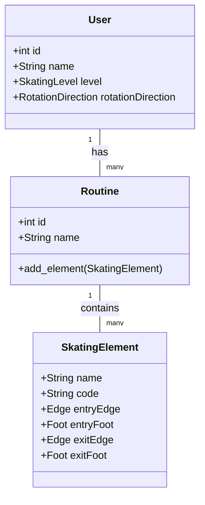
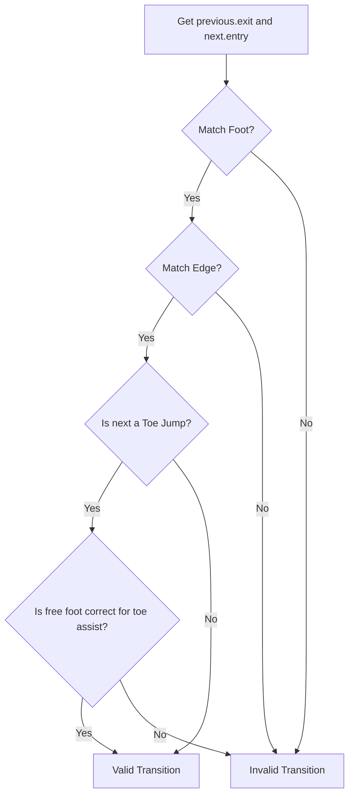

# Design Document: Skating Routine App

## 1. Overview

This document outlines the design for a Flutter mobile application that assists figure skaters in creating routines. The app, targeting the USFS (U.S. Figure Skating) system, will help users select elements appropriate for their level and generate valid connecting elements to form a feasible, well-balanced program. The application will feature user profiles, routine storage, and a visual representation of the routine on a rink diagram.

## 2. Detailed Analysis of the Goal

Figure skaters, coaches, and choreographers face a complex challenge when building a routine. They must create a program that is not only artistically pleasing but also technically compliant with strict rules for a given competition level.

The core problems to be solved are:
- **Rule Compliance:** Ensuring the routine contains the correct number and type of elements (jumps, spins, steps) required for a specific USFS level (e.g., a "well-balanced program").
- **Element Feasibility:** Ensuring that the sequence of elements is physically possible. The exit of one element must flow logically and safely into the entry of the next. This depends on factors like the skater's direction of rotation, the entry/exit edge, and the landing foot.
- **Visualization:** It can be difficult to visualize the flow and ice coverage of a routine from a simple list of elements.

This application aims to solve these problems by providing a rule-based engine to validate element transitions and a visual tool to see the program laid out on the ice.

## 3. Alternatives Considered

### Data Persistence
- **`sqflite`:** A relational database. **Chosen.** This is ideal for the structured, relational data we need (Users, Routines, Elements) and for querying elements based on various criteria.
- **`hive`:** A lightweight NoSQL key-value store. Considered but rejected because the relationships between routines and elements are better suited to a relational model.
- **`Firebase/Cloud`:** A cloud-based solution. Rejected for Version 1 to maintain simplicity and offline-first functionality.

### State Management
- **`Provider` with `ChangeNotifier`:** **Chosen.** It is a Flutter Favorite, relatively simple to understand, and powerful enough to manage the app's state, including the current routine being built and user profile information.
- **`Bloc`:** A more structured, event-based system. Considered but deemed overly complex for the initial version of the application.

### Visual Diagram Implementation
- **`CustomPainter`:** A low-level canvas painting API built into Flutter. **Chosen.** This provides maximum flexibility to draw the rink and the element patterns precisely as needed without introducing external dependencies.
- **Third-Party Charting/Drawing Libraries:** Considered but rejected to avoid reliance on external packages that may not offer the specific visualization needed for skating patterns.

## 4. Detailed Design

### Data Models

The core of the application will be built on these data models:

```dart
enum SkatingLevel { PrePreliminary, Preliminary, ..., Senior }
enum RotationDirection { Clockwise, CounterClockwise }
enum Edge { Inside, Outside, Flat }
enum Foot { Left, Right }
enum ElementType { Jump, Spin, StepSequence }

class User {
  int id;
  String name;
  SkatingLevel level;
  RotationDirection rotationDirection;
}

class Routine {
  int id;
  int userId;
  String name;
  List<SkatingElement> elements;
}

class SkatingElement {
  String name;
  String code; // e.g., "1A" for single Axel
  ElementType type;
  SkatingLevel minLevel;

  // Properties for transition validation
  Edge entryEdge;
  Foot entryFoot;
  bool isToeAssist;
  Edge exitEdge;
  Foot exitFoot;
}
```

### Core Logic: The Transition Rule Engine

A service class, `TransitionValidator`, will contain the primary logic.

`bool canConnect(SkatingElement previous, SkatingElement next, RotationDirection direction)`

This function will be the brain of the app. It will use a set of rules to determine if `next` can follow `previous`.

**Example Rule:**
- A skater with `CounterClockwise` rotation lands a standard Axel.
- `previous.exitEdge` = `Back Outside`
- `previous.exitFoot` = `Right`
- A valid `next` element could be a `three turn` that starts on the `Right` foot with a `Back Outside` edge, or a `toe loop` that uses the `Left` toe pick for assist while skating on the `Right` back outside edge.
- An invalid `next` element would be one that requires a `Left` foot entry edge.

### UI/UX Flow

1.  **Profile Screen:** On first launch, the user is prompted to create a profile, selecting their `SkatingLevel` and `RotationDirection`. This can be edited later.
2.  **Routine List Screen:** The main dashboard, showing a list of the user's saved routines. A "+" button allows for the creation of a new routine.
3.  **Routine Builder Screen:** This is the primary workspace.
    - **Top:** A search bar to find and add `SkatingElement`s. The search will filter based on the user's level.
    - **Middle:** A tabbed view for the routine.
        - **List View:** A re-orderable list (`ReorderableListView`) of the elements in the routine. Invalid transitions will be highlighted in red with an error icon.
        - **Diagram View:** A `CustomPaint` widget using a `RinkPainter` to draw a visual representation of the ice coverage and element flow.
    - **Bottom:** A summary of the routine's compliance with the well-balanced program requirements for the user's level.

### Visual Diagram (`RinkPainter`)

A `RinkPainter` class extending `CustomPainter` will be implemented.
- The `paint` method will first draw a static rink outline.
- It will then iterate through the `List<SkatingElement>` of the current routine.
- For each element, it will draw a pre-defined path on the canvas. For example:
    - **Lutz Jump:** A long, shallow curve for the entry edge, a small loop icon for the jump itself, and a deeper curve for the landing edge.
    - **Step Sequence:** A serpentine line covering the length of the ice.
- The painter will maintain the current position and direction on the "ice" to chain the element drawings together realistically.

## 5. Diagrams (Mermaid Format)

### Class Diagram



### Transition Logic Flowchart



## 6. Summary

The proposed design provides a robust foundation for the Skating Routine App. It uses a relational data model (`sqflite`), clear state management (`Provider`), and a flexible custom UI for visualization (`CustomPainter`). The core of the application is the rule-based `TransitionValidator` which will provide skaters with immediate feedback on the feasibility of their programs. This design is scalable for adding more elements, levels, and rules in the future.

## 7. References

The design of the rule engine and element database is informed by general knowledge of figure skating and the following search queries:
- "guide to figure skating jumps"
- "USFS figure skating well-balanced program requirements"

